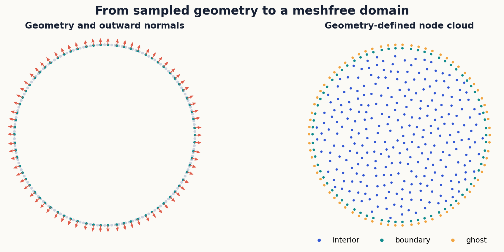
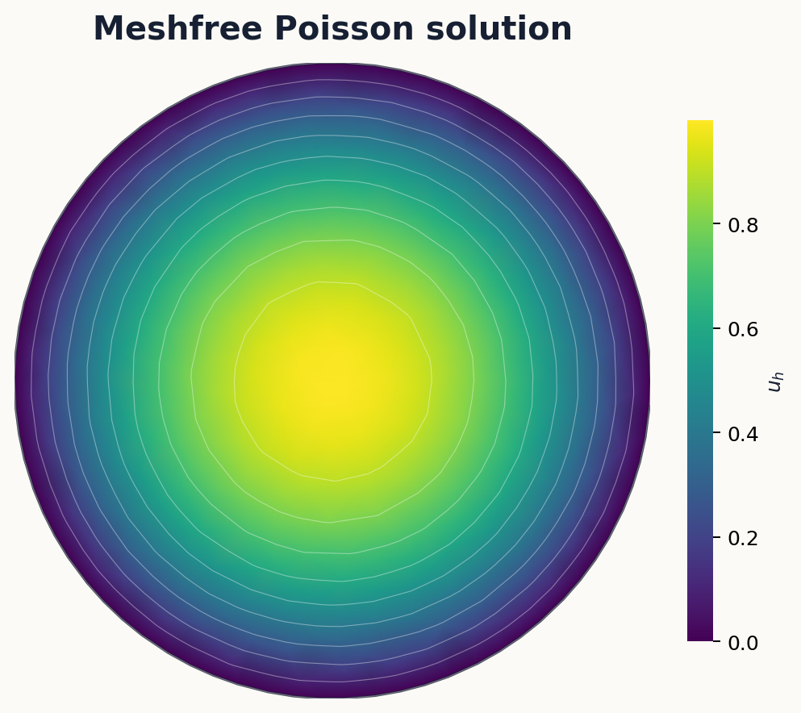
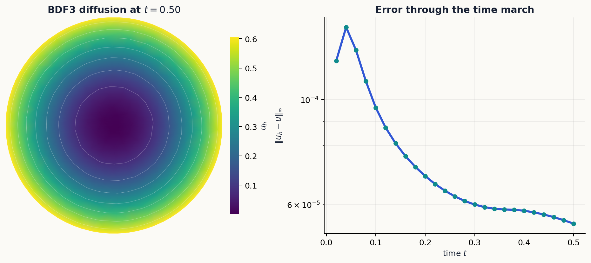

# kernelpack-python

[](https://github.com/VarShankar/kernelpack-python/actions/workflows/python.yml)
[](https://github.com/VarShankar/kernelpack-python/releases/latest)
[](LICENSE)
[](#requirements)

**Meshfree geometry, RBF-FD, partition-of-unity methods, and PDE solvers for
Python.**

`kernelpack-python` is the NumPy/SciPy member of the KernelPack family. It
brings meshfree geometry, scattered-node generation, polynomial tools,
RBF-FD, partition-of-unity approximation, and PDE solvers into a Python
codebase built from inspectable arrays, sparse operators, and compiled
numerical kernels. Companion implementations are available in
[`kernelpack-matlab`](https://github.com/VarShankar/kernelpack-matlab) and
[`kernelpack-jax`](https://github.com/VarShankar/kernelpack-jax).



The figure shows the geometry pipeline used by the PDE solvers: an embedded
boundary and its normals define a level set, and the node generator fills the
interior while retaining boundary and ghost-node structure.

[Install](#installation) | [First solve](#first-solve) |
[Workflows](#fixed-domain-workflows) | [Moving domains](#moving-domain-pdes) |
[Moving surfaces](#moving-surface-pdes) |
[Examples](#examples) | [Tests](#verification) |
[Papers](#research-foundations) | [Citation](#citation)

## What it includes

- Geometry models for smooth and piecewise-smooth embedded boundaries and
  surfaces, including PHS geometric fits, RBF level sets, normals, and
  projection
- Seeded fixed- and variable-radius Poisson node generation, geometry-aware
  clipping, boundary refinement, ghost nodes, and dual node sets
- Shared Legendre polynomial and multi-index utilities
- Standard and overlapped PHS+poly RBF-FD, weighted least squares, localized
  partition-of-unity approximation, and divergence-free interpolation
- Fixed-domain Poisson, variable and nonlinear variable-coefficient Poisson,
  BDF diffusion, localized PU diffusion, and multispecies diffusion solvers
- Semi-Lagrangian BDF1--BDF3 advection--diffusion--reaction on domains with
  moving embedded boundaries in two and three dimensions
- Tangent-plane RBF-FD operators for stationary and moving surfaces, including
  defect-corrected updates, hyperviscosity, quadrature, mass projection,
  marker rearrangement, and history backfill
- Mean-curvature flow and transport on externally generated material
  trajectories
- Numba-parallel local kernels, SciPy KD trees, batched LAPACK, sparse GMRES,
  and ILU preconditioning

The main namespaces are `kernelpack.geometry`, `kernelpack.nodes`,
`kernelpack.domain`, `kernelpack.manifold`, `kernelpack.poly`, `kernelpack.rbffd`,
`kernelpack.divfree`, and `kernelpack.solvers`.

## Supported workflows

- Smooth and piecewise-smooth embedded geometry in two and three dimensions
- Fixed- and variable-density Poisson sampling and level-set clipping
- Standard, overlapped, weighted-least-squares, and PU local approximation
- Fixed-domain elliptic, diffusion, and multispecies diffusion problems
- Moving-domain advection--diffusion--reaction with embedded boundaries
- Conservative transport and reaction--diffusion on stationary or evolving
  closed surfaces
- Geometric surface evolution, marker-quality monitoring, rearrangement, and
  semi-Lagrangian BDF-history reconstruction
- Local and global interpolation of scalar and divergence-free vector fields

## Execution model

Repeated numerical kernels run outside the Python interpreter: Numba builds
tangent-plane local systems in parallel and applies stencil operators inside
GMRES, while SciPy supplies compiled KD-tree searches, batched LU solves, ILU,
and sparse Krylov iterations. Python remains responsible for user callbacks,
time-level orchestration, file I/O, and topology-changing node-set updates.

## Requirements

- Python 3.11 or newer
- NumPy 2.0 or newer
- SciPy 1.14 or newer
- Numba 0.61 or newer
- Matplotlib 3.9 or newer is optional and used by examples and figure scripts

## Installation

### Clone the repository

```bash
git clone https://github.com/VarShankar/kernelpack-python.git
cd kernelpack-python
python -m venv .venv
```

Activate the environment on macOS or Linux:

```bash
source .venv/bin/activate
```

Activate it on Windows:

```powershell
.venv\Scripts\Activate.ps1
```

Install the package and example dependencies:

```bash
python -m pip install -e ".[examples]"
```

For development, install the test and build tools as well:

```bash
python -m pip install -e ".[dev]"
```

## First solve

This example constructs a disk from boundary samples, generates interior and
ghost nodes, solves $-\Delta u = 4$ with $u=0$ on the boundary, and plots the
numerical solution.

```python
import matplotlib.pyplot as plt
import matplotlib.tri as mtri
import numpy as np

from kernelpack.geometry import EmbeddedSurface
from kernelpack.nodes import DomainNodeGenerator
from kernelpack.solvers import PoissonSolver

t = np.linspace(0.0, 2.0 * np.pi, 200, endpoint=False)
surface = EmbeddedSurface()
surface.set_data_sites(np.column_stack([np.cos(t), np.sin(t)]))
surface.build_closed_geometric_model_ps(2, 0.08, t.size)
surface.build_level_set_from_geometric_model()

generator = DomainNodeGenerator()
domain = generator.build_domain_descriptor_from_geometry(
    surface, 0.08, seed=17, strip_count=5
)

solver = PoissonSolver(
    lap_assembler="fd",
    bc_assembler="fd",
    lap_stencil="rbf",
    bc_stencil="rbf",
)
solver.init(domain, 4)

forcing = lambda x: 4.0 * np.ones(x.shape[0])
neumann = lambda xb: np.zeros(xb.shape[0])
dirichlet = lambda xb: np.ones(xb.shape[0])
boundary_data = lambda neu, diri, normals, xb: np.zeros(xb.shape[0])
result = solver.solve(forcing, neumann, dirichlet, boundary_data)

x = domain.get_int_bdry_nodes()
tri = mtri.Triangulation(x[:, 0], x[:, 1])
plt.tripcolor(tri, result["u"], shading="gouraud")
plt.gca().set_aspect("equal")
plt.colorbar(label="u")
plt.title("Poisson solution")
plt.show()
```



## Fixed-domain workflows

All solvers use a `DomainDescriptor`, so geometry, node generation, and local
operator construction remain separate from the PDE definition. A target
spatial order `xi` determines the polynomial reproduction degree and the lower
odd-degree PHS used by the local stencil builders.

The elliptic solver family supports Dirichlet, Neumann, and mixed boundary
rows. Pure-Neumann systems use an explicit null-space augmentation. The
variable-coefficient solver assembles the divergence-form operator, while the
nonlinear variant applies Newton iterations with sparse linear solves.

`DiffusionSolver` advances fixed-domain problems with BDF1, BDF2, or BDF3 and
reuses time-independent operators and preconditioners where possible. The PU
variants localize approximation and support single- or multispecies diffusion,
including distinct diffusivities by species.

The same geometry and node descriptors feed every solver. This makes it
possible to compare standard RBF-FD, overlapped RBF-FD, weighted least squares,
and localized PU assembly without rewriting the domain construction or
boundary callbacks.



## Moving-domain PDEs

`MovingDomainADRSolver` advances

\[
\frac{D c}{D t}=\nu\Delta c+\lambda c+f
\]

on domains with moving embedded boundaries. RK3 advances boundary markers;
the geometric model reconstructs the boundary; the background cloud is carved
and refilled; and local PHS+Legendre interpolation supplies semi-Lagrangian
BDF1--BDF3 history values. Diffusion and reaction are solved implicitly with
overlapped RBF-FD, GMRES, and ILU. The same implementation supports the 2D
moving-hole and 3D moving-cavity examples.

```bash
python examples/moving_domain_adr_example.py
python examples/moving_domain_adr_3d_example.py
```

## Moving-surface PDEs

The surface solver discretizes

\[
\partial^\bullet c+c\,\nabla_\Gamma\!\cdot\mathbf{w}
=\nu\Delta_\Gamma c+R+f
\]

with target-centered tangent-plane PHS+Legendre RBF-FD. The implementation
provides direct assembly, cached-factor defect updates, adaptive
hyperviscosity, spherical and toroidal geometry models with analytic normals
and quadrature, matrix-free implicit diffusion, BDF1--BDF3 material histories,
mass projection, RK3 marker motion, local or SBF transfer, and semi-Lagrangian
history backfill. The same operators also advance
\(\mathbf{X}_t=\Delta_\Gamma\mathbf{X}\) by explicit or semi-implicit
mean-curvature-flow steps.

```bash
python examples/stationary_surface_adr_example.py
python examples/moving_surface_adr_example.py
python examples/mean_curvature_flow_sphere_example.py
python examples/mean_curvature_flow_ellipsoid_example.py
python examples/surface_rearrangement_example.py
```

The three-dimensional red-blood-cell example replays the public IBAMR
trajectory distributed in the shared data release. The downloader verifies
the archive before installing the trajectory locally; the solver then
reconstructs SBF geometry and normals, advances a source-free diffusing tracer
with the same tangent-plane ADR machinery, enforces the quadrature mass law,
and writes the final point cloud and concentration to `artifacts/`.

```bash
python scripts/download_rbc_capstone_data.py
python examples/moving_surface_rbc_capstone.py
```

The default command processes the complete 401-frame trajectory. Use
`--steps 2` only for a short installation check.

## Examples

Complete workflows live in [`examples`](examples):

| Goal | Example |
| --- | --- |
| Solve Poisson's equation | [`poisson_solver_example.py`](examples/poisson_solver_example.py) |
| Verify a two-dimensional pure-Neumann Poisson solve | [`poisson_convergence_2d_neumann.py`](examples/poisson_convergence_2d_neumann.py) |
| Verify a three-dimensional pure-Neumann Poisson solve | [`poisson_convergence_3d_neumann.py`](examples/poisson_convergence_3d_neumann.py) |
| Solve variable and nonlinear variable-coefficient Poisson problems | [`variable_poisson_solver_example.py`](examples/variable_poisson_solver_example.py) |
| Compare FD and localized-PU diffusion | [`diffusion_solver_example.py`](examples/diffusion_solver_example.py) |
| Compare standard, heterogeneous, and PU multispecies diffusion | [`multispecies_diffusion_example.py`](examples/multispecies_diffusion_example.py) |
| Solve moving-domain ADR in two dimensions | [`moving_domain_adr_example.py`](examples/moving_domain_adr_example.py) |
| Exercise moving-domain ADR in three dimensions | [`moving_domain_adr_3d_example.py`](examples/moving_domain_adr_3d_example.py) |
| Verify stationary-surface ADR | [`stationary_surface_adr_example.py`](examples/stationary_surface_adr_example.py) |
| Verify moving-surface ADR on a breathing sphere | [`moving_surface_adr_example.py`](examples/moving_surface_adr_example.py) |
| Evolve a sphere by mean curvature | [`mean_curvature_flow_sphere_example.py`](examples/mean_curvature_flow_sphere_example.py) |
| Smooth an ellipsoid by mean curvature | [`mean_curvature_flow_ellipsoid_example.py`](examples/mean_curvature_flow_ellipsoid_example.py) |
| Remap markers and semi-Lagrangian-backfill BDF history | [`surface_rearrangement_example.py`](examples/surface_rearrangement_example.py) |
| Transport and diffuse a tracer on an IBAMR red-blood-cell trajectory | [`moving_surface_rbc_capstone.py`](examples/moving_surface_rbc_capstone.py) |

Run a study from the repository root, for example:

```bash
python examples/poisson_convergence_2d_neumann.py --orders 2 4 6
```

Generated tables, JSON data, and figures are written under `artifacts/`, which
is intentionally excluded from version control. The committed README figures
can be regenerated with:

```bash
python scripts/render_readme_examples.py
```

## Verification

Install the development dependencies and run the complete public suite:

```bash
python -m pip install -e ".[dev]"
python -m pytest -q
```

The same suite runs on Python 3.11 and 3.12 in GitHub Actions for every push
and pull request.

## Research foundations

`kernelpack-python` brings together methods developed across several papers.
Please cite the publications corresponding to the parts of the library used in
your work.

| Code or method | Publication |
| --- | --- |
| Surface RBF-FD foundations | V. Shankar, G. B. Wright, R. M. Kirby, and A. L. Fogelson, [*A radial basis function (RBF)-finite difference (FD) method for diffusion and reaction-diffusion equations on surfaces*](https://doi.org/10.1007/s10915-014-9914-1), Journal of Scientific Computing 63 (2015), 745--768 |
| Overlapped RBF-FD assembly (`kernelpack.rbffd.FDODiffOp`) | V. Shankar, [*The overlapped radial basis function-finite difference (RBF-FD) method: A generalization of RBF-FD*](https://doi.org/10.1016/j.jcp.2017.04.037), Journal of Computational Physics 342 (2017), 211--228 |
| PHS geometric models and Poisson node generation (`kernelpack.geometry`, `kernelpack.nodes`) | V. Shankar, R. M. Kirby, and A. L. Fogelson, [*Robust node generation for mesh-free discretizations on irregular domains and surfaces*](https://doi.org/10.1137/17M114090X), SIAM Journal on Scientific Computing 40 (2018), A2584--A2608 |
| Lower odd-degree PHS selection used by the solver stencil defaults | V. Shankar and A. L. Fogelson, [*Hyperviscosity-based stabilization for radial basis function-finite difference (RBF-FD) discretizations of advection-diffusion equations*](https://doi.org/10.1016/j.jcp.2018.06.036), Journal of Computational Physics 372 (2018), 616--639 |
| Hyperviscosity for surface transport | V. Shankar, G. B. Wright, and A. Narayan, [*A robust hyperviscosity formulation for stable RBF-FD discretizations of advection-diffusion-reaction equations on manifolds*](https://doi.org/10.1137/19M1288747), SIAM Journal on Scientific Computing 42 (2020), A2371--A2401 |
| Moving-domain ADR | V. Shankar, G. B. Wright, and A. L. Fogelson, [*An efficient high-order meshless method for advection-diffusion equations on time-varying irregular domains*](https://doi.org/10.1016/j.jcp.2021.110633), Journal of Computational Physics 445 (2021), 110633 |
| Moving-surface ADR | M. Lowery, G. B. Wright, and V. Shankar, [*A high-order, meshless, Lagrangian--Eulerian RBF-FD method for advection--diffusion--reaction on moving manifolds*](https://doi.org/10.48550/arXiv.2608.19384), arXiv:2608.19384 (2026) |

## Citation

Software citation metadata are provided in [`CITATION.cff`](CITATION.cff).
Please also cite the method papers corresponding to the components used in
your work.

## Contributing

Bug reports, focused pull requests, and reproducible numerical examples are
welcome. See [`CONTRIBUTING.md`](CONTRIBUTING.md) for the development workflow
and [`SECURITY.md`](SECURITY.md) for responsible vulnerability reporting.

## License

`kernelpack-python` is released under the [BSD 3-Clause License](LICENSE),
which permits academic and commercial use, modification, and redistribution
subject to its terms.
